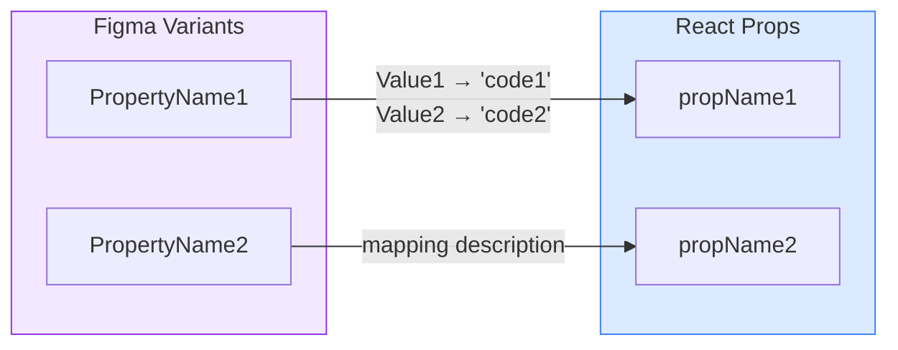

# Generate Figma Code Connect for React Components

## When to Use This Skill
User provides a Figma component URL (or component name) and wants to generate the Code Connect mapping for it.

## Required Inputs
1. **Figma component identifier** (one of):
   - Full URL: `https://figma.com/design/{fileKey}/{fileName}?node-id={nodeId}`
   - File key + node ID: `fileKey: abc123, nodeId: 45:67`
   - Evidence file path: `.temp/figma-explore/{component}.json` or `.temp/figma-connect-shadcn/{component}.json`
   - Component name (will search for URL in project files)
2. **Code component folder path** (e.g., `src/components/Button/Button.tsx`)

## Execution Steps

### 1. Gather Figma Component Data

**Option A: Evidence File Provided (Preferred)**

If an evidence file from `figma-explore` is provided (e.g., `.temp/figma-explore/{component}.json`):
- Read the JSON file directly
- Extract: `id` (node ID), `name`, `variants`, `variantProperties`, `componentPropertyDefinitions`
- The file contains all the variant names and values needed for Code Connect

Example evidence file structure:
```json
{
  "id": "16:1234",
  "name": "Button",
  "type": "COMPONENT_SET",
  "variants": [
    { "name": "Type=Primary, Size=Small", "id": "16:1235" },
    { "name": "Type=Primary, Size=Large", "id": "16:1236" }
  ],
  "variantProperties": {
    "Type": ["Primary", "Secondary", "Ghost"],
    "Size": ["Small", "Medium", "Large"]
  },
  "componentPropertyDefinitions": {
    "Label": { "type": "TEXT", "defaultValue": "Button" },
    "Show Icon": { "type": "BOOLEAN", "defaultValue": false }
  }
}
```

**Option B: URL/Node ID Provided (MCP Fallback)**

If only a Figma URL or node ID is provided:

1. **Search for existing evidence files** in `.temp/figma-explore/` or `.temp/figma-connect-shadcn/` that match the component name
2. **If not found, use MCP tools**:
   - Call `mcp_figma_get_metadata` with `nodeId` and `fileKey`
   - Call `mcp_figma_get_design_context` with `nodeId` and `fileKey`

### 2. Discover Figma URL (if needed)
If no URL or evidence file provided, search for it:
1. Check `{ComponentFolder}/README.md` for "Figma Source" section
2. Check `specs/**/tasks.md` for component-to-Figma mapping tables
3. Check `.temp/figma-explore/figma-components-index.json` or `.temp/figma-connect-shadcn/figma-components-index.json` for matching component names
4. Check prior conversation context for file key

### 3. Read Code Component and Inline the Mapping Contract

1. Read the specified component file — identify exports, props interface, component name
2. **If `.temp/design-components/{component-name}/proposed-api.md` exists, read it and inline the prop-to-Figma mapping table into your working context.** Do not reference this file by path during generation — the full mapping must be in active context so no property is guessed or missed.
3. Cross-check: every prop in the React interface should have a corresponding Figma source in the table. Props with no Figma source (e.g., `className`, `id`) are omitted from Code Connect.

### 4. Generate Mapping
- Declare each prop as a top-level `const` using `figma.selectedInstance.*` methods
- Build the example using the `figma.code` tagged template literal
- Add appropriate imports

### 5. Write Code Connect File
- Output to: `{ComponentFolder}/{ComponentName}.figma.ts`
- Raw file content only—no markdown fences

### 6. Update README with Mapping Diagram
If `{ComponentFolder}/README.md` exists, ensure it has a **Design-to-Code Mapping** section with a mermaid flowchart at the top showing the Figma-to-React property relationships.

**Diagram format:**


**Placement:** The mermaid diagram should be placed immediately after the `## Design-to-Code Mapping` heading, before any tables.

**Example README structure:**
```markdown
## Design-to-Code Mapping

```mermaid
flowchart LR
    subgraph Figma["Figma Variants"]
        FSize["Size"]
        FType["Type"]
    end

    subgraph React["React Props"]
        RSize["size"]
        RVariant["variant"]
    end

    FSize -->|"Small → 'sm'<br>Medium → 'md'<br>Large → 'lg'"| RSize
    FType -->|"Primary → 'primary'<br>Secondary → 'secondary'"| RVariant

    style Figma fill:#f3e8ff,stroke:#9333ea
    style React fill:#dbeafe,stroke:#3b82f6
` ` `

### Variant Mappings
| Figma Variant | Figma Value | React Prop | React Value |
...
```

**Rules for the diagram:**
- Include all mapped variant properties (from `getEnum()` calls)
- Include boolean properties that map to React props
- Show value transformations on the arrows (e.g., `"Small → 'sm'"`)
- Use `<br>` for multiple value mappings on one arrow
- Exclude pseudo-states (hover, focus, pressed) from the diagram
- Use purple styling for Figma subgraph, blue for React subgraph

## Rules

### Use Exact Figma Property Names
**Critical:** Code Connect requires the EXACT property names as they appear in Figma.

- Get exact names from evidence files or `get_metadata` output
- Property names like `ButtonType`, `Type`, `Size` must match EXACTLY (case-sensitive)
- The `get_design_context` MCP tool normalizes to camelCase — **do NOT use those names**
- Property names are case-sensitive: `Size` ≠ `size`

Example from metadata:
```
name="ButtonType=Responsive, Type=Primary, Size=Small"
```
Use in Code Connect:
```ts
const size = instance.getEnum('Size', { ... })    // ✅ Exact match
const variant = instance.getEnum('Type', { ... }) // ✅ Exact match
```

### Only Use Real Figma Properties
Map based on what exists in Figma:
- **Variant/enum properties** → `instance.getEnum()`
- **Boolean properties** → `instance.getBoolean()`
- **Text/string properties** → `instance.getString()`
- **Instance swap properties** → `instance.getInstanceSwap()`
- **Slot properties** → `instance.getSlot()`
- **Nested layer by name** → `instance.findInstance()`, `instance.findText()`
- **Nested by Code Connect ID** → `instance.findConnectedInstance()`, `instance.findConnectedInstances()`

**Never invent properties that don't exist in Figma.**

### Value Conventions
- Drop pseudo-state variants: `hover`, `pressed`, `focused`, `state`, `interaction`
- Map Figma Title Case to code: `Primary` → `'primary'`, `Small` → `'sm'`
- Normalize boolean variants: "Yes"/"No", "True"/"False", "On"/"Off" → `true`/`false`

### Prop Rendering in the Template

The `figma.code` tag does **not** auto-format values — you control the output syntax:

| Prop type | Template syntax | Output |
|---|---|---|
| String enum | `size="${size}"` | `size="small"` |
| Boolean | `disabled={${disabled}}` | `disabled={false}` or omit via `renderProp` |
| Instance/JSX | `icon={${icon}}` | `icon={<Icon />}` |
| String children | `>${label}<` | `>Click me<` |
| Unknown/mixed type | `${figma.helpers.react.renderProp('size', size)}` | handles all types correctly |

**Never use `{${varName}}` for string enum values** — it outputs `size={small}` (looks like an undefined JS variable). Use `"${size}"` for known strings.

When the prop type could be a string, boolean, instance, or undefined, use `figma.helpers.react.renderProp` instead of hardcoding the syntax.

### Critical Constraint: No JavaScript Expressions in Templates
`figma.code` snippets are **not executed** — they are rendered as static display strings.

**Never use:**
```ts
figma.code`${hasIcon ? iconSnippet : null}`  // ✓ OK — ternary on snippet values is fine
figma.code`${'<Icon />' + iconSnippet}`       // ✗ string concatenation — breaks rendering
```

Ternary conditionals on snippet values (`ResultSection[]`) are fine. String concatenation is not.

## API Reference

### Instance Access

```ts
import figma from 'figma'

const instance = figma.selectedInstance  // new API (recommended)
// or
const instance = figma.currentLayer      // legacy API
```

### Property Methods

```ts
// String property
const label = instance.getString('Label')

// Boolean property (simple)
const disabled = instance.getBoolean('Disabled')

// Boolean with value mapping
const icon = instance.getBoolean('Has Icon', {
  true: instance.getInstanceSwap('Icon')?.executeTemplate().example,
  false: undefined,
})

// Enum/Variant property
const size = instance.getEnum('Size', {
  Small: 'sm',
  Medium: 'md',
  Large: 'lg',
})

// Instance swap property (nested component)
const iconInstance = instance.getInstanceSwap('Icon')
const iconSnippet = iconInstance?.executeTemplate().example

// Slot property (open beta)
const slotContent = instance.getSlot('Slot Name')

// Raw property value (no mapping)
const raw = instance.getPropertyValue('Prop Name')
```

### Finding Nested Layers

```ts
// Find child instance by Figma layer name
const icon = instance.findInstance('Icon Layer Name')
const iconSnippet = icon.executeTemplate().example

// Find child by Code Connect ID (preferred over layer name — stable across renames)
const btn = instance.findConnectedInstance('button')
const btnSnippet = btn.executeTemplate().example

// Find all children matching a selector
const items = instance.findConnectedInstances(node => node.codeConnectId() === 'list-item')
const itemSnippets = items.map(i => i.executeTemplate().example)

// Find all layers matching a predicate
const layers = instance.findLayers(node => node instanceof TextHandle)

// Find text layer by name
const text = instance.findText('Label Layer')
const textContent = text.textContent

// SelectorOptions (optional second arg on all find* methods)
const nested = instance.findInstance('Icon', {
  path: ['Parent Layer'],   // restrict to specific parent hierarchy
  traverseInstances: true,  // search through nested instances
})
```

### figma.code Template

Use `figma.code` as a tagged template literal. Interpolate property values and nested snippets:

```ts
export default {
  example: figma.code`
    <Button size="${size}" disabled={${disabled}}>
      ${label}
    </Button>
  `,
}
```

You can compose nested `figma.code` blocks:

```ts
const label = figma.code`<label>${labelContent}</label>`
export default {
  example: figma.code`
    <Button>
      ${iconSnippet}
      ${label}
    </Button>
  `,
}
```

### figma.helpers.react

Use these when prop type is dynamic or you want automatic correct formatting:

```ts
// renderProp — handles all types correctly, use when type is unknown
figma.helpers.react.renderProp('disabled', true)      // → " disabled"
figma.helpers.react.renderProp('disabled', false)     // → ""
figma.helpers.react.renderProp('label', 'Click me')   // → ' label="Click me"'
figma.helpers.react.renderProp('count', 42)           // → " count={42}"
figma.helpers.react.renderProp('icon', iconSnippet)   // → " icon={<Icon />}"

// renderChildren — renders children based on type
figma.helpers.react.renderChildren('Hello')           // → "Hello"
figma.helpers.react.renderChildren(snippets)          // → ResultSections

// Value type wrappers (used with renderProp)
figma.helpers.react.jsxElement('<CustomIcon />')      // → icon={<CustomIcon />}
figma.helpers.react.identifier('myVariable')          // → value={myVariable}
figma.helpers.react.function('() => alert("hi")')     // → onClick={() => alert("hi")}
figma.helpers.react.object({ color: 'red' })          // → sx={{ color: "red" }}
figma.helpers.react.templateString('Hello ${name}')   // → message={`Hello ${name}`}
figma.helpers.react.reactComponent('MyComponent')     // → <MyComponent /> as children
figma.helpers.react.array([1, 2, 3])                  // → items={[1,2,3]}
figma.helpers.react.stringifyObject({ a: 1 })         // → "{ a: 1 }"
```

### Export Format

```ts
export default {
  example: figma.code`...`,   // required — the rendered snippet
  imports: string[],          // required — shown at top of snippet
  id: string,                 // required — unique identifier for this template
  metadata?: {
    nestable?: boolean,       // true = inline in parent; false = expandable pill
    props?: Record<string, any>, // data available to parents via executeTemplate().metadata.props
  },
}
```

### Metadata Comments (top of file)

```ts
// url=https://www.figma.com/design/{fileKey}/File?node-id=1:2   (required)
// source=src/components/Button/Button.tsx                        (optional — shown in Figma)
// component=Button                                               (optional — shown in Figma)
```

## Complete Example

```ts
// url=https://www.figma.com/design/abc123/File?node-id=1:2
// source=src/components/Button/Button.ts
// component=Button

import figma from 'figma'

const instance = figma.selectedInstance

const variant = instance.getEnum('Variant', {
  Primary: 'primary',
  Secondary: 'secondary',
})
const size = instance.getEnum('Size', {
  Small: 'sm',
  Medium: 'md',
  Large: 'lg',
})
const disabled = instance.getBoolean('Disabled')
const label = instance.getString('Label')
const iconInstance = instance.getInstanceSwap('Icon')
const iconSnippet = iconInstance?.executeTemplate().example

export default {
  id: 'Button',
  imports: ['import { Button } from "@/components/Button"'],
  example: figma.code`
    <Button variant="${variant}" size="${size}" disabled={${disabled}} icon={${iconSnippet}}>
      ${label}
    </Button>
  `,
  metadata: { nestable: true },
}
```

### Example with renderProp (mixed/unknown prop types)

```ts
// url=https://www.figma.com/design/abc123/File?node-id=3:4
// source=src/components/Card/Card.ts
// component=Card

import figma from 'figma'

const instance = figma.selectedInstance

const slotNo = instance.getEnum('Slot No.', {
  '1 Slot': '1 Slot',
  '2 Slots': '2 Slots',
})
const header = instance.getInstanceSwap('Header Slot')?.executeTemplate().example
const main = instance.getInstanceSwap('Main Slot')?.executeTemplate().example

export default {
  id: 'Card',
  imports: ['import { Card } from "@/components/Card"'],
  example: figma.code`<Card slotNo="${slotNo}" headerSlot={${header}} mainSlot={${main}} />`,
  metadata: { nestable: true },
}
```

### Example with nested connected instances

```ts
// url=https://www.figma.com/design/abc123/File?node-id=5:6

import figma from 'figma'

const instance = figma.selectedInstance

const items = instance.findConnectedInstances(node => node.codeConnectId() === 'tab-item')
const itemSnippets = items.map(i => i.executeTemplate().example)

export default {
  id: 'TabGroup',
  imports: ['import { TabGroup, Tab } from "@/components/Tabs"'],
  example: figma.code`
    <TabGroup>
      ${figma.helpers.react.renderChildren(itemSnippets)}
    </TabGroup>
  `,
  metadata: { nestable: false },
}
```

## What NOT to Do

- **Don't use `get_design_context` property names.** MCP normalizes them to camelCase. The actual Figma property names are Title Case with spaces (e.g., `Has Icon`, `ButtonType`, `Size`). Use `get_metadata` output or the raw variant names from evidence files.
- **Don't invent properties that don't exist in Figma.** If `proposed-api.md` lists a prop like `className` that has no Figma source, omit it from Code Connect entirely.
- **Don't use `{${varName}}` for string enums.** It outputs `size={small}` — looks like an undefined JS variable. Use `"${varName}"` for known strings, or `figma.helpers.react.renderProp` for mixed types.
- **Don't use the old `figma.connect()` API.** The new template API uses `figma.selectedInstance.*` and `export default { ... }`.
- **Don't concatenate snippet values.** `'<Tag />' + snippetVar` breaks rendering. Always compose inside `figma.code\`...\``.
- **Don't map pseudo-states.** `hover`, `focus`, `pressed`, `active` Figma variants have no corresponding props — exclude them.
- **Don't reference `proposed-api.md` by path during generation.** The mapping contract must be inlined into your working context in Step 3.

## Output

Write raw file content only — no markdown fences, no explanations.

**File location:** `{ComponentFolder}/{ComponentName}.figma.ts`

Example: `src/components/inline-edit/EditableText/EditableText.figma.ts`

File must be immediately usable with `npm run figma:publish`.
