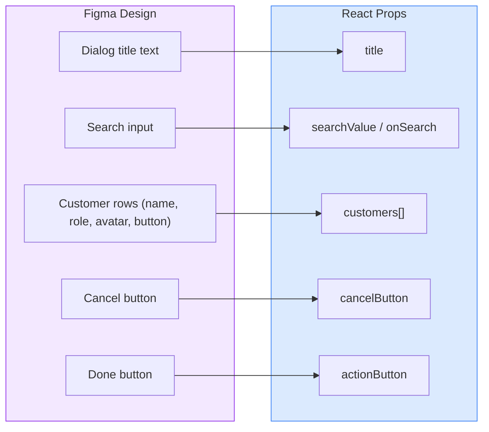

# CustomerListDialog

A composed dialog component that displays a searchable list of customers. Each row shows an avatar, name, role, and a configurable action button. Wraps the Obra `Dialog` (Desktop Scrollable) with `DialogHeader`, `Input`, `Avatar`, and `Button` primitives.

## Figma Source

https://www.figma.com/design/z6KFvMeKnhIAGbQP7tOSkE/Obra-shadcn-ui--Carton-Latest-?node-id=3122-97

## Design-to-Code Mapping



## Usage

```tsx
import { CustomerListDialog } from '@/components/common/CustomerListDialog';
import { Button } from '@/components/obra/Button';

const customers = [
  { name: 'Sarah Chen', role: 'Product Manager', initials: 'SC' },
  { name: 'Marcus Johnson', role: 'Senior Developer', initials: 'MJ' },
];

<CustomerListDialog
  open={isOpen}
  onOpenChange={setIsOpen}
  customers={customers}
  onMessageCustomer={(customer) => console.log('Message', customer.name)}
  cancelButton={
    <Button variant="outline" size="sm" onClick={() => setIsOpen(false)}>
      Cancel
    </Button>
  }
  actionButton={
    <Button variant="primary" size="sm" onClick={handleDone}>
      Done
    </Button>
  }
/>
```

## Props

### `CustomerListDialog`

| Prop | Type | Default | Description |
|------|------|---------|-------------|
| `open` | `boolean` | `undefined` | Controls dialog open state |
| `onOpenChange` | `(open: boolean) => void` | `undefined` | Callback when open state changes |
| `title` | `string` | `"Customer List"` | Dialog header title |
| `customers` | `CustomerCardProps[]` | required | List of customers to display |
| `searchValue` | `string` | `undefined` | Controlled search input value |
| `onSearch` | `(value: string) => void` | `undefined` | Called on search input change |
| `onMessageCustomer` | `(customer: CustomerCardProps) => void` | `undefined` | Called when a row's action button is clicked |
| `cancelButton` | `React.ReactNode` | `<Button variant="outline">Cancel</Button>` | Custom cancel button |
| `actionButton` | `React.ReactNode` | `<Button variant="primary">Done</Button>` | Custom action button |
| `className` | `string` | `undefined` | Extra Tailwind classes |

### `CustomerCardProps`

| Prop | Type | Default | Description |
|------|------|---------|-------------|
| `name` | `string` | required | Customer full name |
| `role` | `string` | required | Customer job title or role |
| `initials` | `string` | First 2 chars of name | Avatar initials |
| `avatarSrc` | `string` | `undefined` | Avatar image URL |
| `actionLabel` | `string` | `"Message"` | Action button label |
| `onAction` | `() => void` | `undefined` | Action button click callback |

## Obra Components Used

- `Dialog` (type: "Desktop Scrollable") — provides the scrollable dialog shell
- `DialogHeader` — renders title + close button
- `Input` — search field
- `Avatar` — customer initials/photo display
- `Button` — action, cancel, and done buttons
