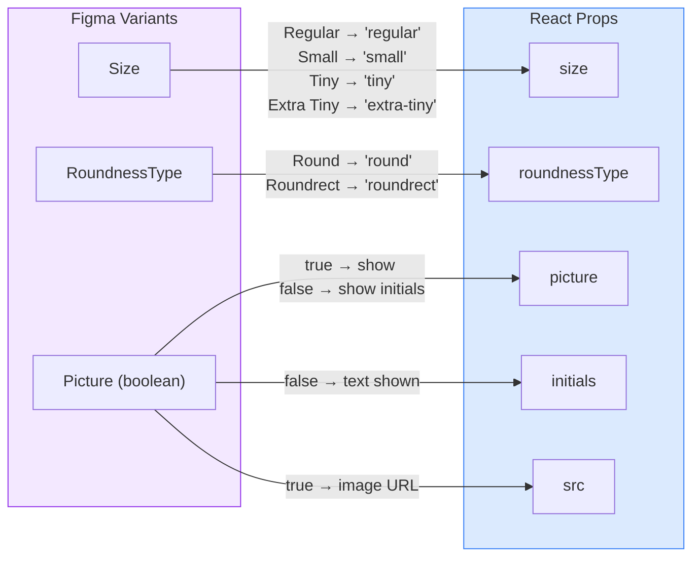

# Avatar

An Avatar component that displays either a profile picture or a fallback placeholder with initials. Supports four sizes and two roundness styles.

## Figma Source

[Obra Avatar – Figma](https://www.figma.com/design/z6KFvMeKnhIAGbQP7tOSkE/Obra-shadcn-ui--Carton-Latest-?node-id=18-1398&m=dev)

## Design-to-Code Mapping



### Variant Mappings

| Figma Variant   | Figma Value   | React Prop      | React Value    |
|-----------------|---------------|-----------------|----------------|
| Size            | Regular       | `size`          | `'regular'`    |
| Size            | Small         | `size`          | `'small'`      |
| Size            | Tiny          | `size`          | `'tiny'`       |
| Size            | Extra Tiny    | `size`          | `'extra-tiny'` |
| RoundnessType   | Round         | `roundnessType` | `'round'`      |
| RoundnessType   | Roundrect     | `roundnessType` | `'roundrect'`  |
| Picture         | true          | `picture`       | `true`         |
| Picture         | false         | `picture`       | `false`        |

## Usage

```tsx
import { Avatar } from '@/components/obra/Avatar';

// Initials fallback (default)
<Avatar initials="AB" />

// Profile picture
<Avatar picture src="https://example.com/photo.jpg" alt="Jane Doe" />

// Small, rounded rectangle
<Avatar size="small" roundnessType="roundrect" initials="JD" />

// Tiny, round, with image
<Avatar size="tiny" roundnessType="round" picture src="..." alt="User" />
```

## Props

| Prop            | Type                                              | Default      | Description |
|-----------------|---------------------------------------------------|--------------|-------------|
| `size`          | `'extra-tiny' \| 'tiny' \| 'small' \| 'regular'` | `'regular'`  | Controls width/height: 20/24/32/40px |
| `roundnessType` | `'round' \| 'roundrect'`                         | `'round'`    | Circle vs. rounded rectangle |
| `picture`       | `boolean`                                         | `false`      | When true, renders `` |
| `src`           | `string`                                          | —            | Image URL (used when `picture=true`) |
| `alt`           | `string`                                          | `''`         | Alt text for image |
| `initials`      | `string`                                          | `'CN'`       | Fallback initials (1–2 chars) |
| `className`     | `string`                                          | —            | Extra CSS classes on root |
