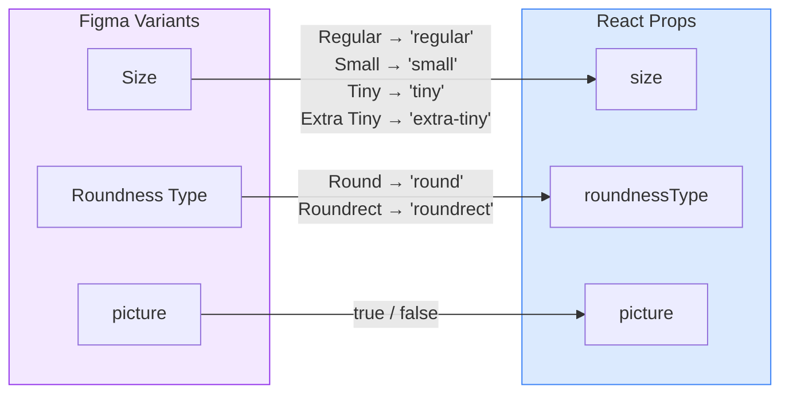

# Avatar

A circular or rounded-rectangle user avatar component from the Obra design system. Displays a profile picture or initials fallback across four sizes.

## Figma Source

https://www.figma.com/design/MQUbIrlfuM8qnr9XZ7jc82/Obra-shadcn-ui--Carton-?node-id=18-1398&m=dev

## Design-to-Code Mapping



### Variant Mappings

| Figma Variant | Figma Value | React Prop | React Value |
|---------------|-------------|------------|-------------|
| Size | Regular | `size` | `'regular'` (40px) |
| Size | Small | `size` | `'small'` (32px) |
| Size | Tiny | `size` | `'tiny'` (24px) |
| Size | Extra Tiny | `size` | `'extra-tiny'` (20px) |
| Roundness Type | Round | `roundnessType` | `'round'` |
| Roundness Type | Roundrect | `roundnessType` | `'roundrect'` |
| Boolean | picture=true | `picture` | `true` |
| Boolean | picture=false | `picture` | `false` (default) |

### Property Mappings

| Figma Property | Type | React Prop | Notes |
|----------------|------|------------|-------|
| picture | Boolean | `picture` | Switches between image and initials mode |
| Image slot | Image | `src` | URL used when `picture=true` |
| Initials text | Text | `initials` | 1–2 characters; defaults to `'CN'` |

### Roundrect Border Radius by Size

| `size` | Border Radius |
|--------|---------------|
| `regular` | `rounded-lg` (8px) |
| `small` | `rounded-[10px]` |
| `tiny` | `rounded-md` (6px) |
| `extra-tiny` | `rounded-sm` (4px) |

### Excluded Properties (CSS/Internal)

| Figma Property | Handling | Reason |
|----------------|----------|--------|
| Background fill | `bg-accent` token | Internal CSS token |
| Typography scale | Derived from `size` prop | Internal |

## Usage

```tsx
import { Avatar } from '@/components/obra/Avatar';

<Avatar initials="JD" size="regular" />
<Avatar initials="JD" size="small" roundnessType="roundrect" />
<Avatar picture src="/user.jpg" alt="Jane Doe" size="regular" />
<Avatar picture src="/user.jpg" alt="Jane Doe" size="small" roundnessType="roundrect" />
```
