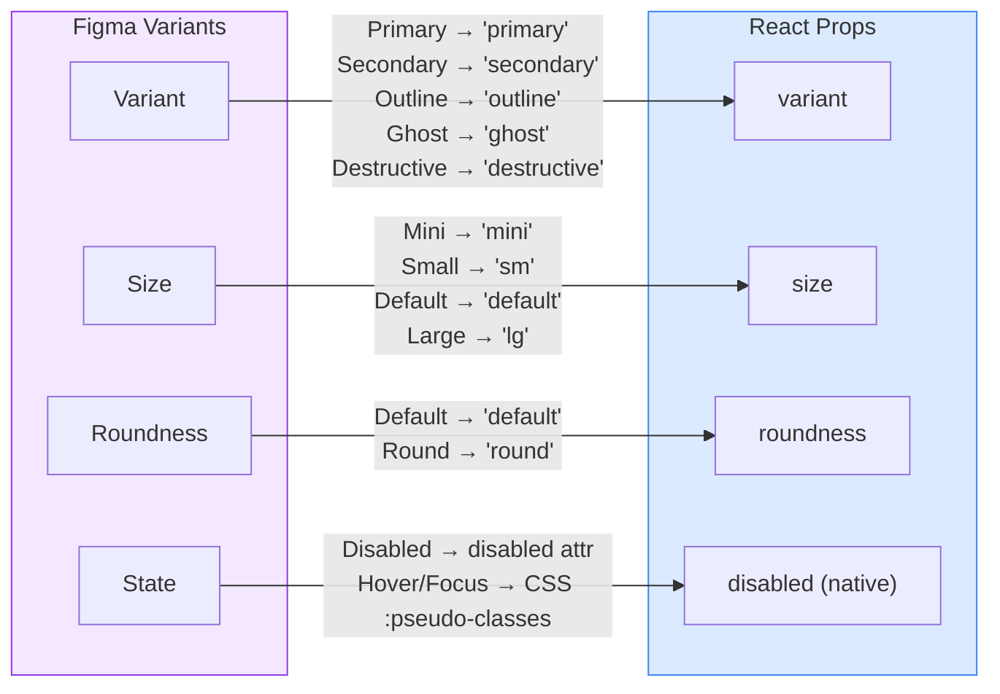

# Button

Obra UI button primitive with 5 variants, 4 sizes, and 2 roundness modes.

## Figma Source

https://www.figma.com/design/z6KFvMeKnhIAGbQP7tOSkE/Obra-shadcn-ui--Figma-to-code-webinar-?node-id=9-1071

## Design-to-Code Mapping



### Variant Mappings

| Figma Property | Figma Value | React Prop | React Value |
|---------------|-------------|------------|-------------|
| Variant | Primary | `variant` | `'primary'` |
| Variant | Secondary | `variant` | `'secondary'` |
| Variant | Outline | `variant` | `'outline'` |
| Variant | Ghost | `variant` | `'ghost'` |
| Variant | Destructive | `variant` | `'destructive'` |
| Size | Mini | `size` | `'mini'` |
| Size | Small | `size` | `'sm'` |
| Size | Default | `size` | `'default'` |
| Size | Large | `size` | `'lg'` |
| Roundness | Default | `roundness` | `'default'` |
| Roundness | Round | `roundness` | `'round'` |
| State | Disabled | `disabled` | `true` |
| State | Hover & Active | — | CSS `:hover` |
| State | Focus | — | CSS `:focus-visible` |

## Usage

```tsx
import { Button } from '@/components/obra/Button';

<Button>Label</Button>
<Button variant="secondary">Secondary</Button>
<Button variant="outline" size="sm">Small Outline</Button>
<Button variant="destructive" size="lg">Delete</Button>
<Button roundness="round">Pill Button</Button>
<Button disabled>Disabled</Button>
```

## Props

| Prop | Type | Default | Description |
|------|------|---------|-------------|
| `variant` | `'primary' \| 'secondary' \| 'outline' \| 'ghost' \| 'destructive'` | `'primary'` | Visual style |
| `size` | `'mini' \| 'sm' \| 'default' \| 'lg'` | `'default'` | Size (height: 24/32/36/40px) |
| `roundness` | `'default' \| 'round'` | `'default'` | Corner radius shape |
| `children` | `ReactNode` | — | Button content |
| `className` | `string` | — | Additional Tailwind classes |
| `...rest` | `ButtonHTMLAttributes` | — | Native button attributes |
