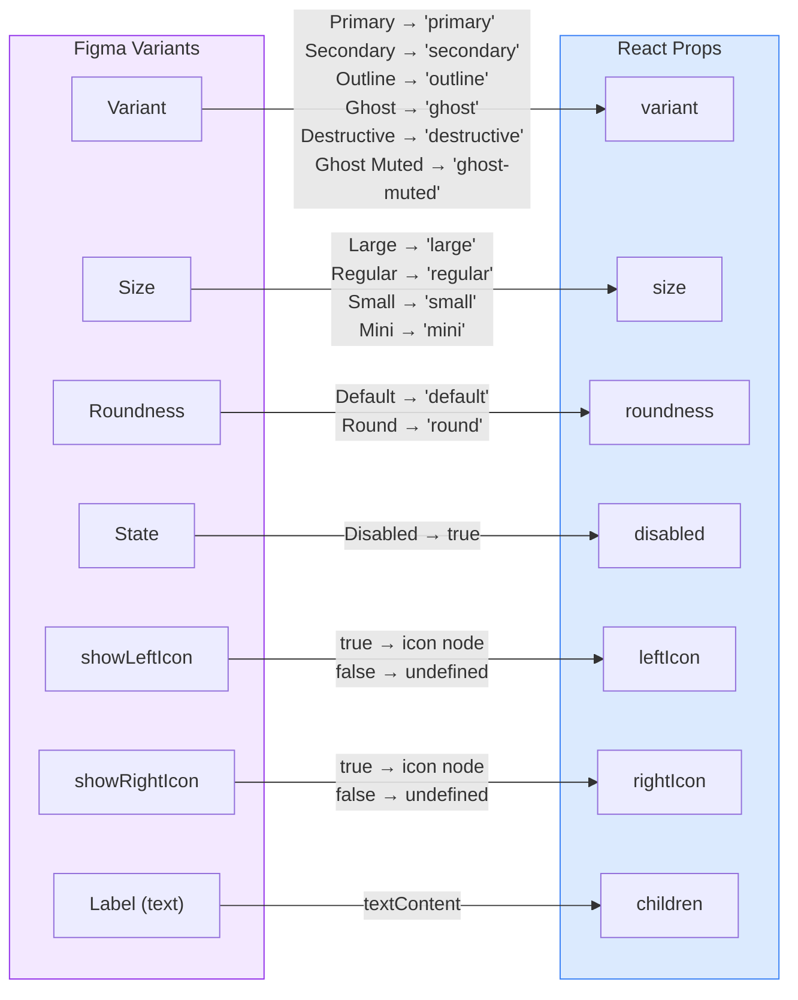

# Button

A flexible, accessible button component built from the Obra design system.

## Figma Source

https://www.figma.com/design/MQUbIrlfuM8qnr9XZ7jc82/Obra-shadcn-ui--Carton-?node-id=9-1071&m=dev

## Design-to-Code Mapping



## Figma→Props Mapping

| Figma Variant | Prop | Values |
|---|---|---|
| Variant: Variant | `variant` | `primary` \| `secondary` \| `outline` \| `ghost` \| `destructive` \| `ghost-muted` |
| Variant: Size | `size` | `mini` \| `small` \| `regular` \| `large` |
| Variant: Roundness | `roundness` | `default` \| `round` |
| Boolean: showLeftIcon | `leftIcon` | `React.ReactNode` |
| Boolean: showRightIcon | `rightIcon` | `React.ReactNode` |
| Text: Label | `children` | `React.ReactNode` |
| State: Disabled | `disabled` | `boolean` (HTML attribute) |

Interactive states (Hover & Active, Focus) are handled via Tailwind pseudo-class modifiers.

## Usage

```tsx
import { Button } from '@/components/obra';

<Button>Save Changes</Button>
<Button variant="destructive" size="large">Delete Account</Button>
<Button variant="outline" leftIcon={<Plus className="h-4 w-4" />}>Add Item</Button>
<Button variant="ghost" roundness="round" disabled>Processing</Button>
```

## Exported API

- `Button` — the React component
- `buttonVariants` — the `cva` helper for reuse in link-buttons or other compound components
- `ButtonProps` — TypeScript props interface
