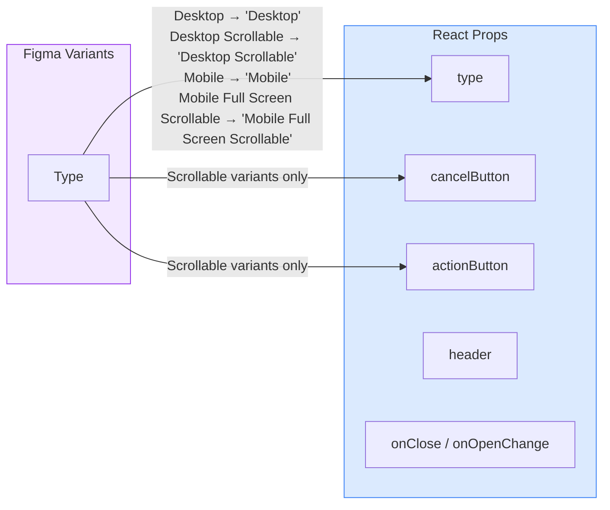

# Dialog

A modal overlay container component.

## Figma Source

https://www.figma.com/design/z6KFvMeKnhIAGbQP7tOSkE/Obra-shadcn-ui--Carton-Latest-?node-id=151-12298&m=dev

## Design-to-Code Mapping



### Variant Mappings

| Figma Variant (`Type`) | React `type` prop | Border | Dimensions | Header/Footer |
|------------------------|-------------------|--------|------------|----------------|
| `Desktop` | `'Desktop'` | Yes | 640×480px | No |
| `Desktop Scrollable` | `'Desktop Scrollable'` | Yes | 640×480px | Yes |
| `Mobile` | `'Mobile'` | Yes | 320×240px | No |
| `Mobile Full Screen Scrollable` | `'Mobile Full Screen Scrollable'` | No | 320×640px | Yes |

## Usage

```tsx
import { Dialog } from '@/components/obra/Dialog';

// Basic desktop dialog
<Dialog onClose={() => setOpen(false)}>
  <p>Dialog content here</p>
</Dialog>

// Scrollable dialog with footer actions
<Dialog
  type="Desktop Scrollable"
  onClose={() => setOpen(false)}
  cancelButton={
    <Button variant="outline" onClick={() => setOpen(false)}>Cancel</Button>
  }
  actionButton={
    <Button onClick={handleSave}>Save Changes</Button>
  }
>
  <p>Long scrollable content...</p>
</Dialog>

// Controlled visibility
<Dialog
  type="Desktop Scrollable"
  open={isOpen}
  onOpenChange={setIsOpen}
>
  <p>Content</p>
</Dialog>
```

## Figma Token Mappings

| Figma Token | CSS Variable | Usage |
|-------------|-------------|-------|
| `general/background` | `--background` | `bg-background` |
| `general/border` | `--border` | `border-border` |
| `radius` (10px) | — | `rounded-[10px]` |
| `shadow-lg` | — | `shadow-lg` |
| `general/foreground` | `--foreground` | Close button icon color |
