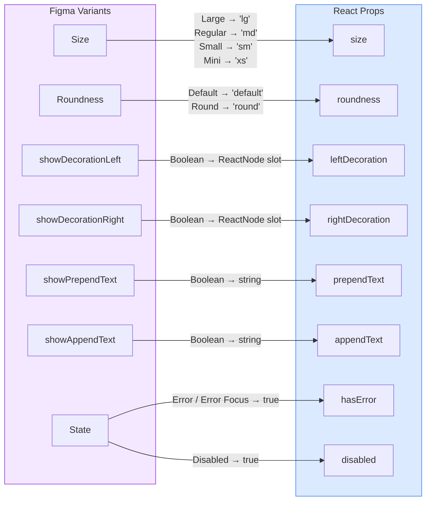

# Input

A text input field from the Obra design system. Wraps a native `<input>` element with support for sizes, roundness styles, icon decorations, prepend/append labels, error state, and disabled state.

## Figma Source

https://www.figma.com/design/z6KFvMeKnhIAGbQP7tOSkE/Obra-shadcn-ui--Carton-Latest-?node-id=16-1738&m=dev

## Design-to-Code Mapping

### Variant Mappings

| Figma Variant | Figma Value | React Prop | React Value |
|---------------|-------------|------------|-------------|
| Size | Large | `size` | `'lg'` |
| Size | Regular | `size` | `'md'` (default) |
| Size | Small | `size` | `'sm'` |
| Size | Mini | `size` | `'xs'` |
| Roundness | Default | `roundness` | `'default'` (default) |
| Roundness | Round | `roundness` | `'round'` |

### Property Mappings

| Figma Property | Type | React Prop | Notes |
|----------------|------|------------|-------|
| showDecorationLeft | Boolean + icon | `leftDecoration` | `ReactNode` – 16×16 icon in padded slot |
| showDecorationRight | Boolean + icon | `rightDecoration` | `ReactNode` – 16×16 icon in padded slot |
| showPrependText | Boolean + text | `prependText` | Muted inline text before the input |
| showAppendText | Boolean + text | `appendText` | Muted inline text after the input |
| State=Error / Error Focus | Variant | `hasError` | `boolean` – red border + error ring on focus |
| State=Disabled | Variant | `disabled` (native) | `opacity-50`, `cursor-not-allowed` |

### Excluded Properties (CSS/Internal)

| Figma Property | Handling | Reason |
|----------------|----------|--------|
| State=Focus | CSS `focus-within` on wrapper | Native browser focus |
| State=Error Focus | `hasError=true` + native focus | Derived from `hasError` + focus |
| State=Empty | Native input | Native browser state |
| State=Placeholder | Native `placeholder` attribute | Native browser state |
| State=Value | Native `value` attribute | Native browser state |
| showCursor | Not implemented | Figma design artifact |

## Accepted Design Differences

| Category | Figma | Implementation | Reason |
|----------|-------|----------------|--------|
| Colors | `--general/border` #e5e5e5 | `--border` #e2e8f0 | Project token mapping |
| Colors | `--focus/ring` #d4d4d4 | `--ring` #cbd5e1 | Project token mapping |
| Colors | `--unofficial/border-4` #a3a3a3 | `--border-4` #94a3b8 | Project token mapping |
| Width | Fixed 320px | `w-full` | Flexible layout |
